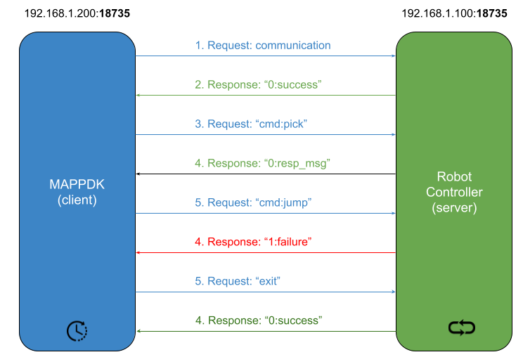

# FANUC Robot Control System Architecture

## System Overview

The FANUC Robot Control System is a comprehensive solution for controlling FANUC robots through a network connection. It consists of two main components:

1. **KAREL/TP Driver (mappdk)**: A set of programs that run on the FANUC robot controller
2. **Python Interface (fanucpy)**: A Python library that provides a high-level API for robot control

This architecture enables the development of sophisticated robot applications that can run on external computers while controlling the physical robot through a standard network connection.



## Communication Flow

The communication flow between the Python application and the FANUC robot is as follows:

1. The Python application creates a `Robot` object and calls `connect()`
2. A TCP socket connection is established to the MAPPDK server running on the FANUC controller
3. Commands are sent as text strings from Python to KAREL
4. The MAPPDK server processes commands and executes the corresponding robot operations
5. Results or status information is returned as text responses
6. The Python library processes the responses and returns results or raises exceptions

## Protocol Details

### Connection Protocol

1. Client connects to server on port 18735
2. Server sends welcome message
3. Client sends commands followed by newline (`\n`)
4. Server responds with code and message format: `<code>:<message>`
5. Code 0 indicates success, 1 indicates error

### Command Format

Commands follow one of two formats:

1. Colon-separated format: `command:arg1:arg2:...`
2. Space-separated format: `command arg1 arg2 ...`

### Response Format

All responses follow the format: `<code>:<message>`

- Success responses: `0:<success-message>`
- Error responses: `1:<error-message>`

## System Components and Interactions

### MAPPDK Server (KAREL)

The MAPPDK server, implemented in `mappdk_server.kl`, is the core component on the robot side. It:

1. Initializes the robot and necessary global variables
2. Opens a TCP server socket and listens for connections
3. Receives commands and dispatches them to the appropriate handlers
4. Manages global state (tool, user frame, coordinate system)
5. Executes robot operations through KAREL routines and TP programs
6. Returns results to the client

### Command Handlers (KAREL)

Command handlers in `mappdk_cmd.kl` process specific command types:

1. Parse the command string into components
2. Validate arguments
3. Execute the operation (motion, I/O, queries, etc.)
4. Return results or error messages

### Motion Execution (TP)

Motion commands are executed through TP programs:

1. Python sends a move command with parameters
2. KAREL sets position register PR[81] and motion parameters (R[81], R[82], R[83])
3. KAREL calls the appropriate TP program (`mappdk_move.ls` or `mappdk_movel.ls`)
4. The TP program executes the motion using the registers
5. Control returns to KAREL which sends the result back to Python

### Kinematic Context (KAREL)

The kinematic context managed by `mappdk_context.kl` ensures that:

1. Tool frames, user frames, and coordinate systems are applied correctly
2. Motion operations respect the current kinematic settings
3. Jogging operations are performed in the appropriate reference frame

### Robot Interface (Python)

The `Robot` class in `robot.py` provides the Python interface:

1. Manages the socket connection to the MAPPDK server
2. Converts high-level Python function calls into protocol commands
3. Sends commands and receives responses
4. Parses responses and handles errors
5. Provides a type-safe, Pythonic API for robot control

### RobotApp Framework (Python)

The `RobotApp` class in `robotapp.py` provides a framework for building applications:

1. Manages the robot connection lifecycle
2. Provides a standardized application structure
3. Handles exceptions and error recovery
4. Makes it easy to create sophisticated robot applications

## File Dependencies and Structure

### KAREL/TP Driver Dependencies

```
mappdk_server.kl
├── mappdk_utils.kl
├── mappdk_comm.kl
├── mappdk_cmd.kl
│   └── (Command Handlers)
├── mappdk_context.kl
│   └── (Tool/User/Coord Management)
└── mappdk_jog.kl
    └── (Jogging Implementation)
```

Execution flow:
```
mappdk_server.kl → mappdk_cmd.kl → Command Handler → (TP Programs if needed)
```

### Python Library Dependencies

```
robot.py
└── (Core Socket Communication)

robotapp.py
└── robot.py

calibration.py
├── robot.py
└── transformations.py
```

Application flow:
```
User Code → robotapp.py → robot.py → Socket → MAPPDK Server
```

## Extension Points

### Adding New Robot Commands

To add new robot commands:

1. Add a command handler in `mappdk_cmd.kl`
2. Update the `HANDLE_CMD` routine to dispatch to the new handler
3. Add a corresponding method in the Python `Robot` class

### Adding New Applications

To create new robot applications:

1. Create a new class that inherits from `RobotApp`
2. Implement the `run()` method with the application logic
3. Instantiate the class and call `connect()`, `run()`, and `disconnect()`

## Best Practices

1. **Error Handling**: Always check for errors and implement proper error recovery
2. **Resource Management**: Use Python's `with` statement or try-finally blocks to ensure robot disconnection
3. **Safety**: Include safety checks and limits in robot applications
4. **Testing**: Test applications in simulation before running on physical robots
5. **Logging**: Enable logging for troubleshooting and debugging

## Command Line Tools

The system includes command line tools for common operations:

- `cli_tool_user_coord.py`: Tool/user frame and coordinate system management
- `cli_jog.py`: Robot jogging operations

These tools provide both practical utility and serve as examples for building more complex applications.

## Example Communication Flow

Here's an example of the communication flow for a move command:

1. Python application calls `robot.move("joint", [0,0,0,0,0,0])`
2. `Robot.move()` constructs the command: `movej:0025:0100:000:0:6:+000.000000000:+000.000000000:+000.000000000:+000.000000000:+000.000000000:+000.000000000`
3. Command is sent over TCP to the MAPPDK server
4. Server dispatches to the `HANDLE_CMD` routine
5. `HANDLE_CMD` identifies the command as "movej" and calls the appropriate handler
6. Handler parses parameters and validates them
7. Handler sets position register PR[81] and motion parameters
8. Handler executes the `MAPPDK_MOVE` TP program
9. Robot moves to the specified position
10. Handler returns success status
11. Server sends response: `0:success`
12. Python `send_cmd` function returns: `(0, "success")`
13. `robot.move()` returns the result to the application

This flow ensures reliable communication and operation between the external application and the physical robot.